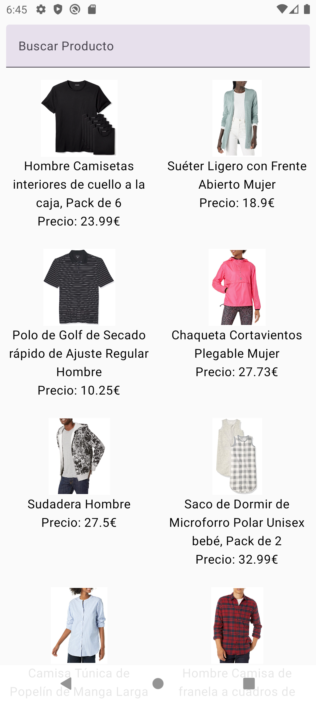

# Android – Retrofit + Compose Products Grid

📚 Curso DAM – PMDM (Android)  
✍️ Entrega: consumo de API pública con **Retrofit** y renderizado con **Jetpack Compose** (búsqueda + grid con imágenes vía Coil).

## 🛠️ Tecnologías

## 🧩 ¿Qué hace?
- Descarga una lista de productos desde una API pública.
- Muestra los productos en una **cuadrícula** (Compose `LazyVerticalGrid`).
- **Búsqueda por nombre** y visualización de **precio** e **imagen** (Coil).

## 🔌 API usada
Endpoint de ejemplo: `https://peticiones.online/api/products`

## 📸 Vista previa

